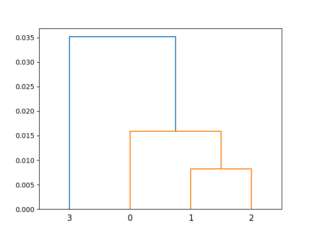
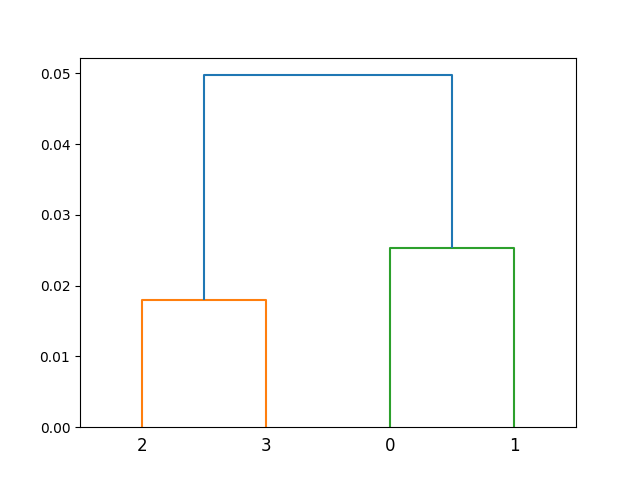
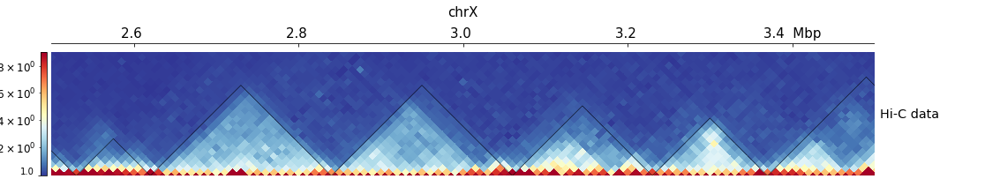
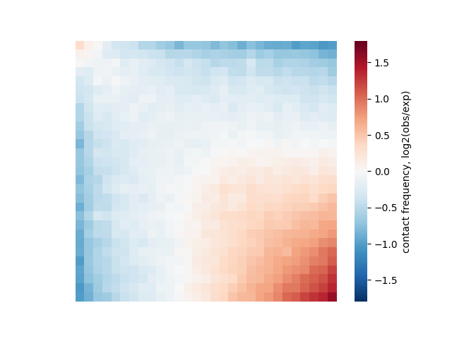
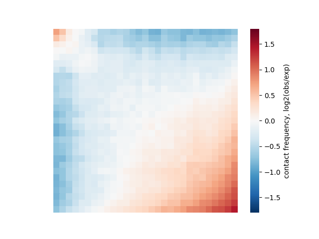
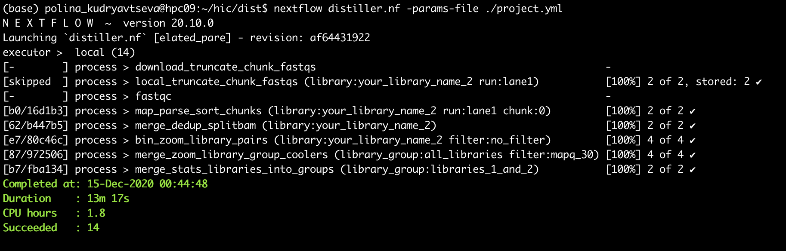

# HiC

### Сравнение реплик инструментом hicper.
```
$ hicrep /home/kononkova/hic_data_hse/lib1.dm3.mapq_30.1000.mcool /home/kononkova/hic_data_hse/lib2.dm3.mapq_30.1000.mcool output_bg.txt --binSize 10000 --h 1 --dBPMax 5000000
$ hicrep /home/kononkova/hic_data_hse/Kc167_rep1.dm3.mapq_30.1000.mcool /home/kononkova/hic_data_hse/Kc167_rep2.dm3.mapq_30.1000.mcool output_kc.txt --binSize 10000 --h 1 --dBPMax 5000000
```
Посчитаем корреляцию для 1,3,5,7,9,12 хромосом, просто скопировав значения в excel. Для нервной ткани получим 8,50E-01, а для эмбриональной 8,37E-01. Для нервной ткани корреляция чуть выше, она стабильнее эмбриональной.

Построим дендрограмму для нервной и аналогично для эмбриональной ткани.
```
from scipy.cluster import hierarchy
import matplotlib.pyplot as plt
import numpy as np


ytdist = np.loadtxt('output_kc.txt')
ytdist = ytdist[[0,2,4,6,8,11]]
ytdist = abs(ytdist - ytdist.mean())
Z = hierarchy.linkage(ytdist, 'single')
plt.figure()
dn = hierarchy.dendrogram(Z)
plt.savefig('den_kc.png')
```

den_kc:



den_bg:



Расстояние между хромосомами в нервной ткани меньше, чем в эмбриональной.

### TADs calling.
```
$ hicFindTADs -m /home/kononkova/hic_data_hse/lib_1_and_2.dm3.mapq_30.1000.mcool::/resolutions/10000 --outPrefix TADs --correctForMultipleTesting fdr --chromosomes chr2L chr2R chr3L chr3R chrX

$ hicFindTADs -m /home/kononkova/hic_data_hse/lib_1_and_2.dm3.mapq_30.1000.mcool::/resolutions/5000 --outPrefix TADs_n --correctForMultipleTesting fdr --chromosomes chr2L chr2R chr3L chr3R chrX --minDepth 15000 --maxDepth 50000
```
Посчитаем в питоне средний размеров ТАДов:
```
content = []
with open("TADs_n_domains.bed")as f:
    for line in f:
        content.append(line.strip().split())
        
n = []
for i in range(len(content)):
    n.append(int(content[i][2]) - int(content[i][1]))

sum(n)/len(n)
```
Аналогичные вычисления сделаем для файла TADs_boundaries.bed. Получим:
- 5000 resolution: 103630 (1130 TADs)
- 10000 resolution: 224575 (518 TADs)

Большее разрешение дает меньший размер тадов. В качестве сравнения с публичными данными нашла статью "Principles of genome folding into topologically associating domains" авторов Quentin Szabo, Frédéric Bantignies, и Giacomo Cavalli. В ней пишут "originally, Hi-Cs in Drosophila revealed approximately 1300 TADs with an average size of nearly 100 kb, but recent studies using higher map resolution showed a finer partitioning into >2000 or >4000 TADs, where TADs and inter-TAD regions can be subdivided into smaller domains with a median size of few tens of kilobases". В целом разрешение в 5000 попадает под описание того, что используется обычно. В данной статье были изучены данные с еще большим разрешеним, а 10000 вероятно считают уже слишком низким разрешением. 

### Визуализация.

Создадим файл hic_track.ini
```
nano hic_track.ini
```
В него скопируем следующее содержимое:
```
[x-axis]
where = top

[hic matrix]
file = /home/kononkova/hic_data_hse/lib_1_and_2.dm3.mapq_30.1000.mcool::/resolutions/10000
title = Hi-C data
# depth is the maximum distance plotted in bp. In Hi-C tracks
# the height of the track is calculated based on the depth such
# that the matrix does not look deformed
depth = 300000
transform = log1p
file_type = hic_matrix

[tads]
file = TADs_domains.bed
file_type = domains
border_color = black
color = none
# the tads are overlay over the hic-matrix
# the share-y options sets the y-axis to be shared
# between the Hi-C matrix and the TADs.
overlay_previous = share-y

[spacer]
```
Создадим изображения:
```
hicPlotTADs --tracks hic_track.ini -o hic_track.png --region chrX:2500000-3500000
hicPlotTADs --tracks hic_track.ini -o hic_track2.png --region chrX:10000000-11000000
```
И скопируем полученные изображения на локальный компьютер:
```
scp -r -P 9022 polina_kudryavtseva@mg.uncb.iitp.ru:~/hic/*png .
```
Получились такие картинки:



На каждом участке нашлось по шесть ТАДов. Хорошо видны ближние взаимодействия. Иные структуры, например, петли я не заметила.

### Взаимосвязь между границами ТАДов и экспрессией.
Скачаем геном дрозофилы в формате genbank: GCF_000001215.4_Release_6_plus_ISO1_MT_genomic.gbff
Скопируем файл с экспрессией:
```
scp -r -P 9022 polina_kudryavtseva@mg.uncb.iitp.ru:~/hic/BG3_genes.txt .
```

```
bins = []
with open("TADs_boundaries.bed") as f:
    for line in f:
        bins.append(line.strip().split())

def n_tads_gene(df, name):
    n_b = 0
    n_t = 0
    
    start = 22235000
    end = 0
    
    for i in range(len(df.features)):
        for j in range(len(bins)):
            if bins[j][0] == name:
                
                if start > int(bins[j][1]): start = int(bins[j][1]) 
                if end < int(bins[j][2]): end = int(bins[j][2])
                
                if int(bins[j][1]) <= int(df.features[i].location.start) and \
                int(bins[j][2]) >= int(df.features[i].location.start) and (j < 2 or j > len(bins) - 2):
                    n_b += 1
                elif int(bins[j][1]) <= int(df.features[i].location.start) and \
                int(bins[j][2]) >= int(df.features[i].location.start):
                    n_t += 1             
                    
    return n_b/(end - start), n_t/(end - start)
```

- chrX: 0.0, 3.072043497961033e-05
- chr2L: 1.9034971226206287e-06, 7.507746790615317e-05
- chr2R: 0.0, 2.6320987654320987e-05
- chr3L: 0.0, 4.408958938199917e-05
- chr3R: 0.0, 3.14327485380117e-05

Считаем файл с генами и выберем 40 с наивысшей экспрессией.
```
genes = []
with open("BG3_genes.txt")as f:
    for line in f:
        genes.append(line.strip().split())
        
genes = sorted(genes, key=lambda x: x[1])
genes = genes[-40:]
```

Я перевела fbgn в gene Symbols с помощью https://www.biotools.fr/drosophila/fbgn_converter, но почему то не нашла ни одного из топ 40 генов в моем варианте сборки. Но в целом, насколько я поняла, идея задания была в том, чтобы убедиться, что высоко экспрессирующиеся гены находятся на границе тадов. Поэтому значения для топ 40 я бы получила выше. Хотя у меня получились нулевые значения для границ по всем генам. В общем, в этом задании я запуталась, возможно была взята какая то плохая сборка.

### Компартменты.
Заупстим скрипт compartments.py на двух хромосомах, исравив пути к файлам.
chrX:



chr2L:



Я ожидала увидеть хорошие диагонали, но тут их нет. Может стоило расслабить пороги на e-value.

### Получение Hi-C карт из fastq-файлов.
Скачаем нужные файлы из базы и сделаем индексы по геному:
```
wget http://hgdownload.soe.ucsc.edu/goldenPath/dm3/bigZips/dm3.chrom.sizes ../
wget http://hgdownload.soe.ucsc.edu/goldenPath/dm3/bigZips/dm3.fa.gz ../
bwa index dm3.fa.gz
```
Укажем в файле config/local.config путь для временной директории и запустим дистиллер (Файл project.yml с параметрами для запуска лежит в этом же репозитории):
```
nextflow distiller.nf -params-file ./project.yml
```
Скриншот работы программы:


```
cooler info results/coolers_library_group/libraries_1_and_2.dm3.mapq_30.1000.cool
cooler info results/coolers_library_group/libraries_1_and_2.dm3.no_filter.1000.cool
```

Предположу, что число контактов печатается с ключом sum. Тогда для отфильтрованный данных мы получили 1022726 контактов, а для нефильтрованных 1055863, что больше. Логично, что фильтрование на качество картирования усеньшило число найденных контаков. 
