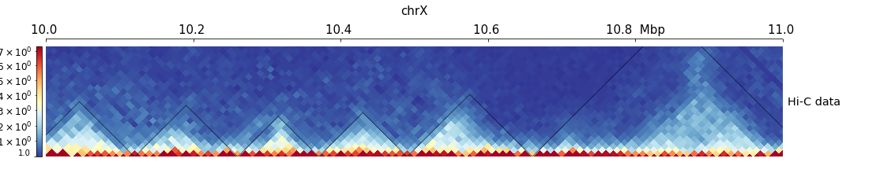

# HiC

### Сравнение реплик инструментом hicper.
```
$ hicrep /home/kononkova/hic_data_hse/lib1.dm3.mapq_30.1000.mcool /home/kononkova/hic_data_hse/lib2.dm3.mapq_30.1000.mcool output_bg.txt --binSize 10000 --h 1 --dBPMax 5000000
$ hicrep /home/kononkova/hic_data_hse/Kc167_rep1.dm3.mapq_30.1000.mcool /home/kononkova/hic_data_hse/Kc167_rep2.dm3.mapq_30.1000.mcool output_kc.txt --binSize 10000 --h 1 --dBPMax 5000000
```
Посчитаем корреляцию для 1,3,5,7,9,12 хромосом, просто скопировав значения в excel. Для нервной ткани получим 8,50E-01, а для эмбриональной 8,37E-01. Для нервной ткани корреляция чуть выше, она стабильнее эмбриональной.

??? Постройте дендрограмму (любым способом) по средним SCC и сделайте выводы. ???

### TADs calling.
```
$ hicFindTADs -m /home/kononkova/hic_data_hse/lib_1_and_2.dm3.mapq_30.1000.mcool::/resolutions/10000 --outPrefix TADs --correctForMultipleTesting fdr --chromosomes chr2L chr2R chr3L chr3R chrX

$ hicFindTADs -m /home/kononkova/hic_data_hse/lib_1_and_2.dm3.mapq_30.1000.mcool::/resolutions/5000 --outPrefix TADs_n --correctForMultipleTesting fdr --chromosomes chr2L chr2R chr3L chr3R chrX --minDepth 15000 --maxDepth 50000
```
??? Средний размер ТАДов ???

### Визуализация.

Создадим файл hic_track.ini
```
nano hic_track.ini
```
В него скопируем следующее содержимое:
```
[x-axis]
where = top

[hic matrix]
file = /home/kononkova/hic_data_hse/lib_1_and_2.dm3.mapq_30.1000.mcool::/resolutions/10000
title = Hi-C data
# depth is the maximum distance plotted in bp. In Hi-C tracks
# the height of the track is calculated based on the depth such
# that the matrix does not look deformed
depth = 300000
transform = log1p
file_type = hic_matrix

[tads]
file = TADs_domains.bed
file_type = domains
border_color = black
color = none
# the tads are overlay over the hic-matrix
# the share-y options sets the y-axis to be shared
# between the Hi-C matrix and the TADs.
overlay_previous = share-y

[spacer]
```
Создадим изображения:
```
hicPlotTADs --tracks hic_track.ini -o hic_track.png --region chrX:2500000-3500000
hicPlotTADs --tracks hic_track.ini -o hic_track2.png --region chrX:10000000-11000000
```
И скопируем полученные изображения на локальный компьютер:
```
scp -r -P 9022 polina_kudryavtseva@mg.uncb.iitp.ru:~/hic/*png .
```
Получились такие картинки:



### Взаимосвязь между границами ТАДов и экспрессией.
### Компартменты.
### Получение Hi-C карт из fastq-файлов.
